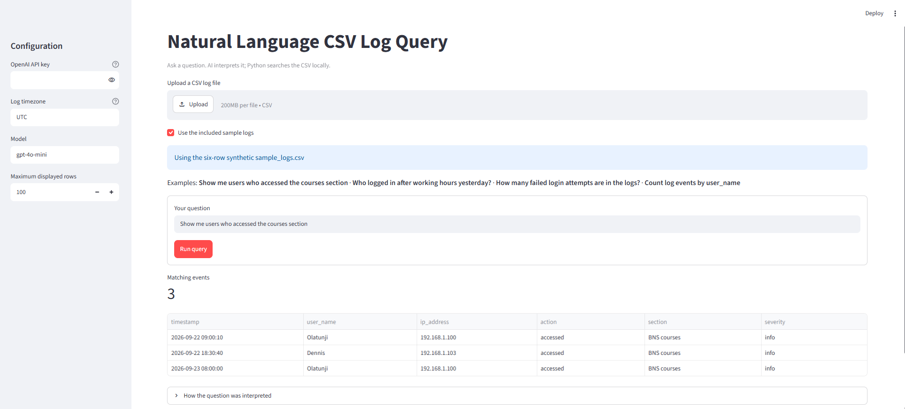
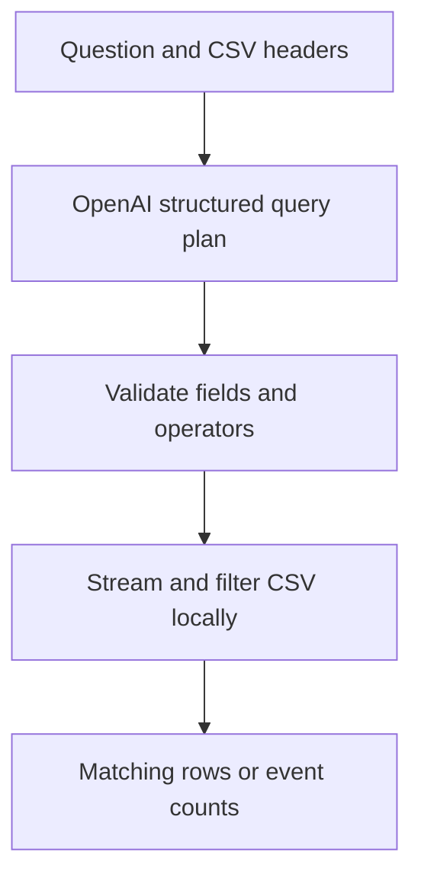

# Natural Language CSV Log Query

A Python and Streamlit tool for asking plain-language questions about security logs stored as CSV files. Upload a log file, ask a question such as **“Who logged in after working hours yesterday?”**, and review the matching events or counts.

The OpenAI API translates the question into a constrained JSON query plan. Python validates that plan and searches the CSV locally. The model does not receive log rows or execute generated code.



## What it can do

- Find events using case-insensitive text filters and relative dates.
- Search for activity after a specified time, including after-hours logins.
- Count matching events or group counts by one column.
- Upload a CSV through the web app or try the included synthetic sample.
- Show the interpreted plan so an analyst can check how the question was translated.
- Stream CSV rows during filtering; only displayed matches and group counts are retained.
  
## How it works



`app.py` provides the Streamlit interface. `log_query.py` requests a structured plan from the OpenAI Responses API, validates it against the actual CSV columns, and applies supported filters with Python's `csv` module. The model receives the question and header names, while the event rows stay in the local application process.

## Run locally

Requires **Python 3.10+** and an OpenAI API key with API billing enabled. API usage is billed separately from a ChatGPT subscription.

```bash
python3 -m venv .venv
source .venv/bin/activate
pip install -r requirements.txt
streamlit run app.py
```

Open `http://localhost:8501`, enter your API key in the masked sidebar field, select **Use the included sample logs** or upload a CSV, enter a question, and select **Run query**. Do not place your API key in the repository.

On Windows, activate the environment with `.venv\Scripts\Activate.ps1`. If Streamlit runs on a remote Ubuntu VM, forward port 8501 over SSH before opening the page on your computer.
The command-line version is also available. Set `OPENAI_API_KEY` in your terminal without saving the key in shell history, then run:

```bash
read -rsp 'OpenAI API key: ' OPENAI_API_KEY; echo; export OPENAI_API_KEY
python log_query.py sample_logs.csv 'Show me users who accessed the courses section' --timezone UTC
```

## Example questions and results

The included `sample_logs.csv` has six synthetic events with `timestamp`, `user_name`, `ip_address`, `action`, `section`, and `severity` columns. These results were observed with live API calls on **2026-09-23**:

| Question |	Result |	Evidence |
| --- | --- | --- |
| Show me users who accessed the courses section | 3 events: Olatunji twice and Dennis once | [Web app search](screenshots/07-web-app-courses-query.png) |
| Who logged in after working hours yesterday? | 2 successful logins: Samuel and Mutwiri; the failed login was excluded | [After-hours search](screenshots/04-ai-after-hours-logins.png) |
| How many failed login attempts are in the logs? | 1 event, using the CSV upload control | [Uploaded CSV count](screenshots/08-web-app-uploaded-csv-count.png) |
| Count log events by user_name | 6 events grouped by user; Olatunji has 2 | [Grouped count](screenshots/06-ai-events-by-user.png) |

“Yesterday” is relative to the run date and chosen timezone. The sample dates are September 22–23, 2026, so use a date-independent question or update the sample timestamps when demonstrating later.

## Supported queries and limits

The query plan supports `search`, `count`, and one-column `group` operations; AND-combined text comparisons (`contains`, `equals`, and `not_equals`); `today` and `yesterday`; and an after-time condition. Timestamps should be ISO 8601. Offset-aware timestamps are converted to the selected timezone; timestamps without an offset are treated as local to that timezone.
This is a focused prototype. It does not support OR filters, numeric ranges, arbitrary date ranges, joins, or distinct-user counts. A grouped result counts events, not unique users. The model may interpret ambiguous terms incorrectly, so inspect the displayed plan and compare it with the CSV's real column names and values. The web app limits displayed rows to 100 by default, but the matching-event count includes the full scanned file. Grouping retains one counter per distinct group. No large-file benchmark was performed; each query scans the CSV once, so indexed storage would be preferable for frequent searches on very large datasets.

## Security and privacy

CSV rows are processed locally, but the question and CSV header names are sent to the OpenAI API. Assess whether those names or questions are sensitive before using real organizational logs. The app temporarily holds an uploaded CSV for a query and removes the temporary file afterward. Avoid putting API keys, production log data, or `.venv` in a public repository. The screenshots and bundled sample contain synthetic data.
